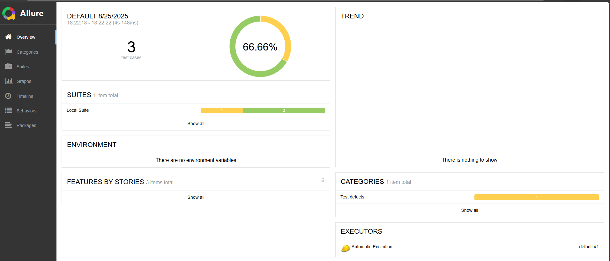
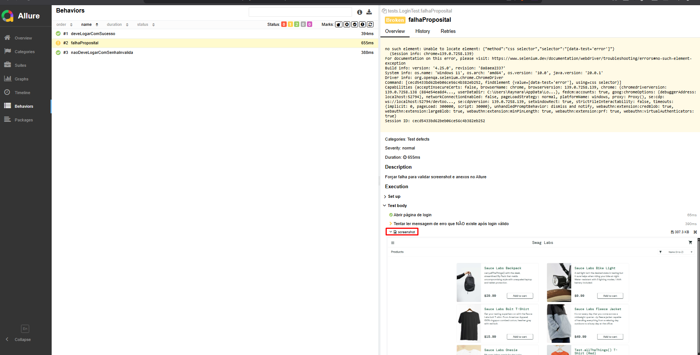

# Selenium Expert Starter (Java + Maven + TestNG)


[](https://github.com/raynara-martins/selenium-expert-starter/actions/workflows/ui-tests.yml)

Projeto base para automação de testes de UI com **Selenium + Java + TestNG**, usando **Page Object Model**, ambientes configuráveis e integração com **GitHub Actions**.

Alvo inicial: https://www.saucedemo.com/  
Credenciais de exemplo: `standard_user` / `secret_sauce`

---

## Como rodar localmente

```bash
# roda a suíte local (sem paralelismo, navegador visível)
mvn clean test -DsuiteXml=testng-local.xml -Dheadless=false
```

**Propriedades úteis (`-D`):**
- `suiteXml` → `testng-local.xml` (debug) ou `testng.xml` (CI)
- `baseUrl` → default: https://www.saucedemo.com
- `browser` → `chrome|firefox|edge` (default: `chrome`)
- `headless` → `true|false` (default: `false`)
- `env` → `qa|dev|prod` (default: `qa`)

Exemplo (dev + firefox + headless):
```bash
mvn test -Denv=dev -Dbrowser=firefox -Dheadless=true
```

Override temporário (sem alterar arquivos):
```bash
mvn test -DbaseUrl=http://localhost:3000 -Dbrowser=firefox
```

## Estrutura do projeto

- `drivers` — WebDriver com **ThreadLocal** (execução paralela segura)  
- `config` — `Config.java`, lê **System properties** e/ou `.properties` por ambiente  
- `support` — helpers (esperas explícitas, utilitários)  
- `pages` — Page Objects (LoginPage, InventoryPage, etc.)  
- `tests` — cenários de teste curtos e legíveis  
- `listeners` — screenshot automático em falhas + anexos do Allure  
- `src/test/resources/environments` — `qa.properties`, `dev.properties`, `prod.properties`, `local.properties` (**local** está no `.gitignore`)  

---

## Relatórios Allure

### Usando Allure CLI
Após rodar os testes:
```bash
allure serve target/allure-results
```
Abre o relatório interativo no navegador.

### Usando Docker (one-shot)
```bash
docker run --rm -p 5050:5050   -v "$(pwd)/target/allure-results:/app/allure-results"   -v "$(pwd)/allure-reports:/app/allure-reports"   frankescobar/allure-docker-service
```
Acesse: http://localhost:5050/allure-docker-service/projects/default/reports/latest/index.html

### Usando Docker Compose
Arquivo `docker-compose.yml` já incluso:
```bash
docker compose up
```
- Lê `./target/allure-results` e gera `./allure-reports` (persistente por padrão).  
- Se quiser **limpar a cada execução**, rode seus testes com `mvn clean ...` (apaga `target/`) ou adicione uma etapa de limpeza antes de subir o serviço.

## Prévia do Relatório Allure

Aqui está um exemplo de relatório Allure gerado pelos testes:





---

## Dicas & Boas práticas

- **Local vs CI**  
  - Use `testng-local.xml` sem paralelismo para **debug** (breakpoints, observação de tela).  
  - Use `testng.xml` (paralelo) em **CI** e execuções rápidas.

- **Headless**  
  - Em CI mantenha `-Dheadless=true`. Localmente, deixe `false` para observar o navegador.

- **Limpeza de relatórios**  
  - `mvn clean` remove `target/` (inclui `allure-results`).  
  - O Docker/Compose escreverá os relatórios prontos em `./allure-reports`.

- **Falhas propositalmente úteis**  
  - Há um cenário de falha demonstrativa para validar screenshots e anexos do Allure.

---